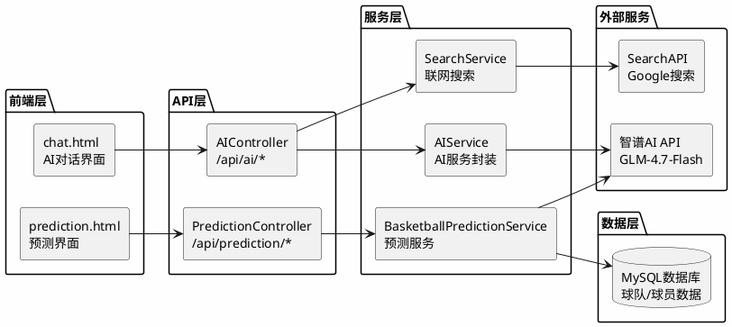

# NBA数据分析系统 - AI业务逻辑说明

## 概述

本系统集成了智谱AI（GLM-4.7-Flash）大语言模型，为用户提供智能化的NBA数据分析服务。AI功能主要分为三大核心模块：**AI智能对话**、**AI比赛预测**、**联网搜索增强**。

---

## 一、AI智能对话模块

### 1.1 功能概述

AI智能对话模块是系统的核心AI交互入口，用户可以通过自然语言与AI助手进行对话，获取NBA数据分析、球员统计解读、比赛预测等专业服务。

### 1.2 核心能力

| 能力 | 说明 |
|------|------|
| 自然语言理解 | 理解用户关于NBA的各种问题 |
| 数据分析 | 解读NBA高级数据指标（PER、WS、BPM、VORP、TS%、USG%等） |
| 多轮对话 | 支持上下文传递，提供连贯的交互体验 |
| 图片分析 | 支持上传图片进行多模态分析 |
| 流式输出 | 实时展示AI回复过程 |

### 1.3 业务流程图

```plantuml
@startuml
left to right direction
skinparam backgroundColor #FEFEFE
skinparam defaultFontName Microsoft YaHei

start
:用户输入问题;
if (是否开启联网搜索?) then (是)
    :调用SearchService联网搜索;
    :获取实时NBA资讯;
    :构建增强消息;
else (否)
endif
:构建API请求;
:调用智谱AI API;
if (API调用是否成功?) then (是)
    :流式接收AI响应;
    :解析思考过程;
    :解析正式内容;
    :通过SSE推送给前端;
else (否)
    :使用本地降级响应;
endif
:前端实时渲染Markdown;
:对话完成;
stop
@enduml
```

### 1.4 核心组件

| 组件 | 文件路径 | 职责 |
|------|----------|------|
| AIController | controller/AIController.java | REST API接口，处理HTTP请求 |
| AIService | service/AIService.java | AI服务封装，API调用逻辑 |
| chat.html | site/chat.html | 前端对话界面，SSE事件处理 |

### 1.5 请求处理流程

**第一步：接收用户请求**

用户通过前端界面输入问题，前端通过SSE（Server-Sent Events）建立长连接，请求地址为 `/api/ai/stream`，参数包括用户消息、对话历史、是否联网搜索等。

**第二步：联网搜索增强（可选）**

如果用户开启了联网搜索功能，系统会先调用SearchService获取实时NBA资讯，将搜索结果作为上下文注入到用户消息中。

**第三步：构建AI请求**

系统构建包含系统提示词、对话历史、用户消息的完整请求。系统提示词设定了AI作为NBA专业分析师的人设。

**第四步：流式调用AI API**

通过OkHttp向智谱AI发起流式请求，启用思考模式，实时接收响应。

**第五步：解析并推送响应**

系统解析AI返回的流式数据，区分"思考过程"和"正式内容"，通过SSE分别推送给前端展示。

### 1.6 系统提示词设计

系统为AI助手设定了专业的NBA分析师人设，主要职责包括：
- 解答NBA相关的问题，包括球队、球员、比赛数据等
- 提供专业的篮球数据分析见解
- 解释NBA高级数据指标
- 分析球队战术和球员表现
- 进行比赛预测和分析
- 分析用户上传的图片内容

### 1.7 本地降级响应

当AI API不可用时，系统提供本地预设响应保证服务可用性，针对排名、预测、问候等常见问题提供预设回复。

---

## 二、AI比赛预测模块

### 2.1 功能概述

AI比赛预测模块利用大语言模型的分析能力，结合球队历史数据，为用户提供专业的比赛预测分析，包括胜负预测、让分预测、大小分预测、胜分差预测等。

### 2.2 预测类型

| 预测类型 | 说明 |
|----------|------|
| 胜负预测 | 预测比赛胜负结果及概率 |
| 让分预测 | 预测让分盘口结果 |
| 大小分预测 | 预测总分大小 |
| 胜分差预测 | 预测最终分差区间 |
| 加时概率 | 预测比赛进入加时的概率 |

### 2.3 业务流程图

```plantuml
@startuml
left to right direction
skinparam backgroundColor #FEFEFE
skinparam defaultFontName Microsoft YaHei

start
:用户选择比赛双方;
:获取球队数据;
:构建预测提示词;
:调用AI进行预测分析;
if (AI调用是否成功?) then (是)
    :解析AI返回的JSON预测结果;
else (否)
    :使用本地算法生成预测;
endif
:返回预测数据;
:调用AI生成详细分析报告;
:流式输出分析内容;
:预测完成;
stop
@enduml
```

### 2.4 核心组件

| 组件 | 文件路径 | 职责 |
|------|----------|------|
| PredictionController | controller/PredictionController.java | 预测API接口 |
| BasketballPredictionService | service/BasketballPredictionService.java | 预测业务逻辑 |

### 2.5 数据准备阶段

系统从数据库获取球队的完整统计数据，包括：
- 胜负战绩、胜率
- 场均得分、篮板、助攻、抢断、盖帽
- 投篮命中率、三分命中率、罚球命中率

### 2.6 预测提示词构建

系统将球队数据组织成结构化的提示词，要求AI返回标准JSON格式的预测结果，包含胜负概率、让分预测、大小分预测、胜分差区间、加时概率等字段。

### 2.7 本地预测算法

当AI API不可用时，系统使用本地算法生成预测：
- 基于球队胜率计算胜负概率
- 考虑主场优势因素
- 基于场均得分计算预期分差

### 2.8 详细分析报告生成

预测完成后，系统会调用AI生成详细的分析报告，包括：
- 比赛整体分析（球队实力对比、近期状态等）
- 关键因素分析（主客场优势、进攻防守对比等）
- 核心球员对位分析
- 需要注意的风险因素

---

## 三、联网搜索增强模块

### 3.1 功能概述

联网搜索增强模块为AI对话提供实时信息支持，使AI能够获取最新的NBA新闻、比赛结果、球员动态等实时数据，弥补大语言模型知识截止日期的限制。

### 3.2 核心能力

| 能力 | 说明 |
|------|------|
| 实时搜索 | 通过Google搜索引擎获取最新信息 |
| 结果解析 | 提取搜索结果标题、摘要、链接 |
| 快速回答 | 获取Google Featured Snippet |
| NBA优化 | 自动添加NBA和年份关键词 |

### 3.3 业务流程图

```plantuml
@startuml
left to right direction
skinparam backgroundColor #FEFEFE
skinparam defaultFontName Microsoft YaHei

start
:接收用户问题;
:构建搜索查询;
:调用SearchAPI;
:Google搜索引擎处理;
:返回搜索结果;
:解析搜索结果;
:提取关键信息;
:格式化为上下文;
:注入AI提示词;
stop
@enduml
```

### 3.4 核心组件

| 组件 | 文件路径 | 职责 |
|------|----------|------|
| SearchService | service/SearchService.java | 联网搜索服务 |

### 3.5 搜索服务实现

系统通过SearchAPI调用Google搜索引擎，支持自定义搜索引擎类型，默认使用Google搜索。

### 3.6 NBA专用搜索

系统为NBA查询做了专门优化，自动添加"NBA"和当前年份关键词，提高搜索结果的相关性。

### 3.7 搜索结果解析

系统将搜索API返回的结果解析为结构化文本：
- 提取前5条有机搜索结果
- 获取标题、摘要、来源链接
- 解析快速回答（Featured Snippet）

### 3.8 与AI对话的集成

搜索结果会作为上下文注入到AI提示词中，AI会基于搜索结果回答用户问题，提供更准确、更及时的回答。

---

## 四、整体架构图



---

## 五、API接口说明

### 5.1 AI对话接口

| 接口 | 方法 | 说明 |
|------|------|------|
| /api/ai/models | GET | 获取可用AI模型列表 |
| /api/ai/chat | POST | 普通聊天请求 |
| /api/ai/stream | GET | SSE流式聊天（支持联网搜索） |

### 5.2 比赛预测接口

| 接口 | 方法 | 说明 |
|------|------|------|
| /api/prediction/teams | GET | 获取球队列表 |
| /api/prediction/stream | GET | SSE流式预测 |

---

## 六、配置说明

### 6.1 AI配置项

| 配置项 | 默认值 | 说明 |
|--------|--------|------|
| ai.api.key | 空 | 智谱AI API密钥（必填） |
| ai.api.url | https://open.bigmodel.cn/api/paas/v4/chat/completions | AI API地址 |
| ai.default-model | glm-4.7-flash | 默认AI模型 |

### 6.2 搜索配置项

| 配置项 | 默认值 | 说明 |
|--------|--------|------|
| search.api.key | 空 | SearchAPI密钥（可选） |
| search.api.url | https://www.searchapi.io/api/v1/search | 搜索API地址 |

---

## 七、技术特点总结

### 7.1 流式响应

系统采用SSE（Server-Sent Events）技术实现流式响应，用户可以实时看到AI的输出过程，提升交互体验。

### 7.2 思考过程展示

系统启用了AI的思考模式，将AI的推理过程（reasoning_content）展示给用户，增强透明度和可信度。

### 7.3 多轮对话

系统支持多轮对话上下文传递，AI可以理解对话历史，提供连贯的交互体验。

### 7.4 联网搜索

通过集成SearchAPI，系统可以为AI提供实时NBA资讯，弥补大语言模型知识截止日期的限制。

### 7.5 本地降级

当AI API不可用时，系统提供本地预设响应和本地预测算法，保证服务的可用性。

### 7.6 多模态支持

系统支持图片分析功能，用户可以上传图片让AI分析，扩展了应用场景。
