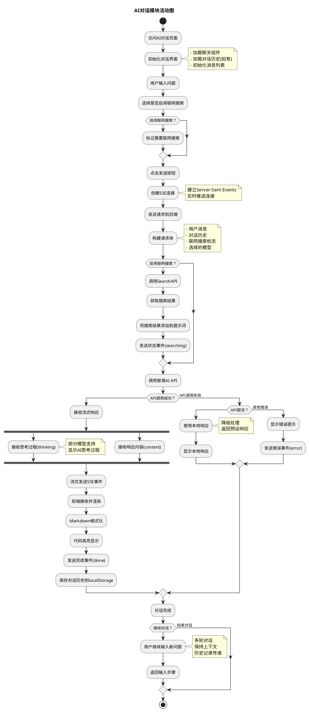
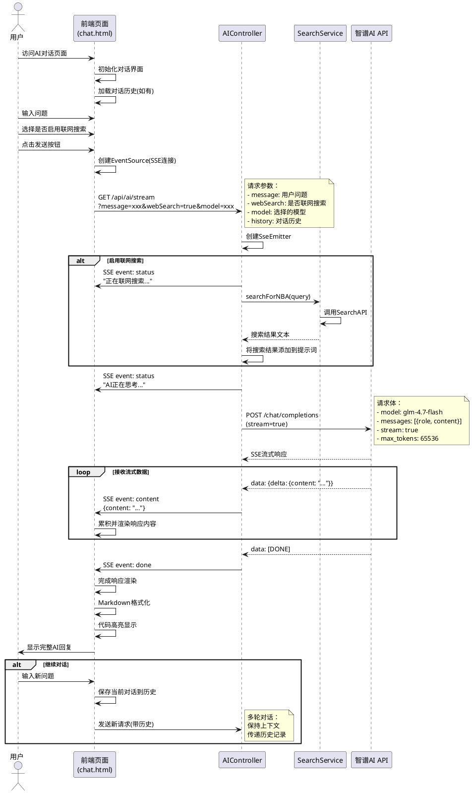

# AI对话模块 - 活动图与时序图

## 一、AI对话模块活动图

### 1.1 活动描述

AI对话模块活动图展示了用户与AI助手进行交互的完整流程。用户访问AI对话页面后，输入问题并发送请求，系统根据是否启用联网搜索决定是否调用搜索服务，然后调用智谱AI API获取响应，通过SSE流式返回给前端展示。

### 1.2 活动流程说明

| 步骤 | 活动名称 | 描述 |
|------|----------|------|
| 1 | 访问AI对话页面 | 用户点击导航栏进入AI助手页面 |
| 2 | 初始化对话界面 | 加载聊天组件和对话历史 |
| 3 | 输入问题 | 用户在输入框输入问题 |
| 4 | 选择联网搜索 | 用户选择是否启用联网搜索功能 |
| 5 | 发送请求 | 点击发送按钮提交问题 |
| 6 | 创建SSE连接 | 建立服务器推送事件连接 |
| 7 | 联网搜索(可选) | 如启用则调用搜索API获取实时信息 |
| 8 | 调用AI API | 调用智谱AI大模型接口 |
| 9 | 流式接收响应 | 通过SSE接收流式数据 |
| 10 | 渲染响应内容 | 使用Markdown渲染AI回复 |
| 11 | 保存对话历史 | 将对话保存到本地存储 |
| 12 | 继续对话 | 用户可继续多轮对话 |

### 1.3 PlantUML活动图代码



---

## 二、AI对话模块时序图

### 2.1 时序图描述

AI对话模块时序图展示了用户、前端页面、后端控制器、搜索服务、智谱AI API之间的交互过程。用户发送问题后，系统根据配置决定是否进行联网搜索，然后调用AI API获取响应，通过SSE流式返回结果。

### 2.2 时序图流程说明

| 步骤 | 交互内容 | 说明 |
|------|----------|------|
| 1 | 访问页面 | 用户进入AI对话页面 |
| 2 | 初始化界面 | 前端加载聊天组件 |
| 3 | 输入问题 | 用户输入要咨询的问题 |
| 4 | 选择联网搜索 | 用户选择是否启用联网搜索 |
| 5 | 创建SSE连接 | 前端建立服务器推送连接 |
| 6 | 发送请求 | 发送包含问题的请求到后端 |
| 7 | 联网搜索(可选) | 如启用则调用搜索服务 |
| 8 | 调用AI API | 调用智谱AI大模型接口 |
| 9 | 流式响应 | 通过SSE推送流式数据 |
| 10 | 渲染内容 | 前端渲染AI回复内容 |
| 11 | 保存历史 | 保存对话历史 |

### 2.3 PlantUML时序图代码



---

## 三、模块功能说明

### 3.1 核心功能

| 功能 | 说明 |
|------|------|
| **多轮对话** | 支持上下文保持，传递对话历史 |
| **联网搜索** | 可选功能，获取实时NBA资讯 |
| **流式响应** | 通过SSE实时推送AI回复 |
| **Markdown渲染** | 支持表格、列表、代码块等格式 |
| **代码高亮** | 使用highlight.js实现语法高亮 |
| **模型选择** | 支持选择不同的AI模型 |

### 3.2 技术实现

| 技术 | 用途 |
|------|------|
| **SSE (Server-Sent Events)** | 实现服务器向客户端的实时推送 |
| **OkHttp** | 后端HTTP客户端，调用AI API |
| **EventSource** | 前端接收SSE事件 |
| **Marked.js** | Markdown解析渲染 |
| **Highlight.js** | 代码语法高亮 |

### 3.3 错误处理

| 错误类型 | 处理方式 |
|----------|----------|
| API限流(429) | 降级为本地预设响应 |
| 网络错误 | 显示错误提示，建议重试 |
| SSE连接断开 | 自动重连或提示用户 |
| 响应超时 | 设置180秒超时，超时提示 |

---

## 四、交互流程总结

```
用户输入问题
    ↓
选择是否联网搜索
    ↓
创建SSE连接
    ↓
发送请求到后端
    ↓
[可选] 联网搜索获取实时信息
    ↓
调用智谱AI API
    ↓
流式接收响应
    ↓
实时渲染内容
    ↓
保存对话历史
    ↓
等待用户继续输入
```

---

*StatCourt NBA数据统计平台*
*AI对话模块设计文档*
