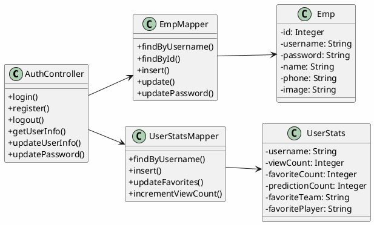
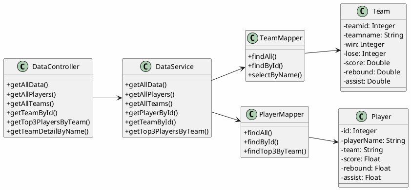
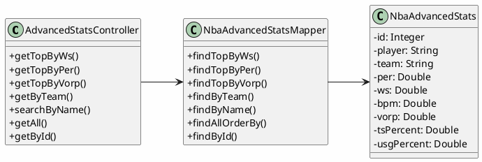
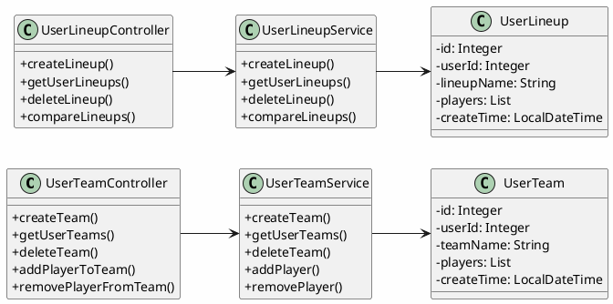
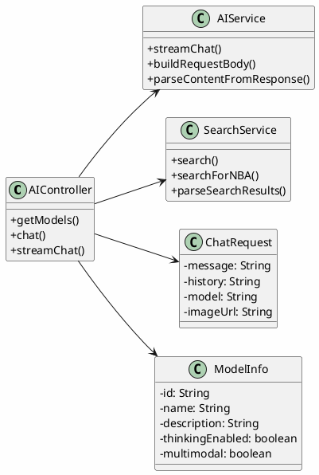
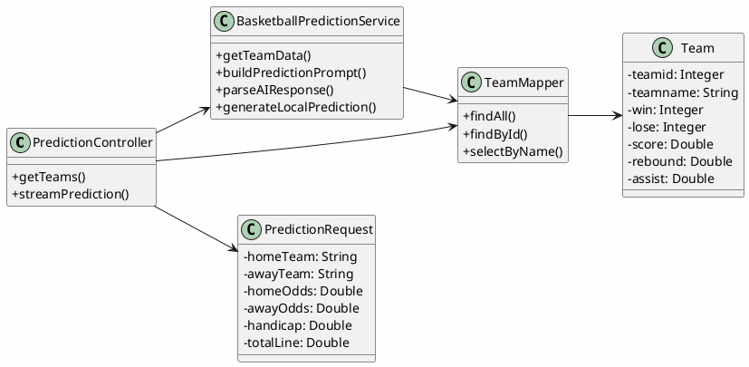
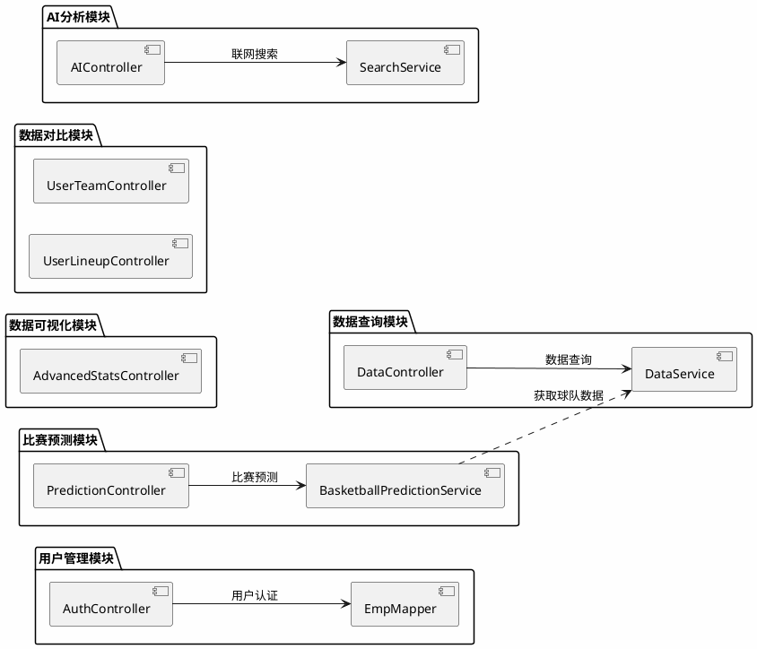

# NBA数据分析系统 - 模块类图

## 一、用户管理模块

用户管理模块负责用户认证、用户信息管理和用户统计数据管理。

### 类说明

| 类名 | 职责 |
|------|------|
| AuthController | 处理用户认证相关请求，包括登录、注册、登出等 |
| Emp | 用户实体类，存储用户基本信息 |
| UserStats | 用户统计数据实体类，记录用户行为统计 |
| EmpMapper | 用户数据访问层，操作用户表 |
| UserStatsMapper | 用户统计数据访问层，操作统计表 |

---

## 二、数据查询模块

数据查询模块提供球队和球员的基础数据查询功能。

### 类说明

| 类名 | 职责 |
|------|------|
| DataController | 数据查询控制器，提供数据查询API接口 |
| DataService | 数据查询服务层，封装数据查询业务逻辑 |
| Team | 球队实体类，存储球队统计数据 |
| Player | 球员实体类，存储球员统计数据 |
| TeamMapper | 球队数据访问层 |
| PlayerMapper | 球员数据访问层 |

---

## 三、数据可视化模块

数据可视化模块提供高级数据指标的查询和展示功能。

### 类说明

| 类名 | 职责 |
|------|------|
| AdvancedStatsController | 高级数据控制器，提供高级指标查询API |
| NbaAdvancedStats | 高级数据实体类，存储PER、WS、BPM、VORP等指标 |
| NbaAdvancedStatsMapper | 高级数据访问层 |

---

## 四、数据对比模块

数据对比模块提供用户自定义阵容和球队对比功能。

### 类说明

| 类名 | 职责 |
|------|------|
| UserTeamController | 用户球队控制器，管理用户自定义球队 |
| UserLineupController | 用户阵容控制器，管理用户自定义阵容 |
| UserTeamService | 用户球队服务层 |
| UserLineupService | 用户阵容服务层 |
| UserTeam | 用户球队实体类 |
| UserLineup | 用户阵容实体类 |

---

## 五、AI分析模块

AI分析模块提供AI智能对话和联网搜索功能。

### 类说明

| 类名 | 职责 |
|------|------|
| AIController | AI控制器，提供AI对话API接口 |
| AIService | AI服务层，封装智谱AI调用逻辑 |
| SearchService | 搜索服务层，提供联网搜索功能 |
| ChatRequest | 聊天请求DTO，封装请求参数 |
| ModelInfo | 模型信息DTO，存储AI模型配置 |

---

## 六、比赛预测模块

比赛预测模块提供基于AI的比赛预测分析功能。

### 类说明

| 类名 | 职责 |
|------|------|
| PredictionController | 预测控制器，提供比赛预测API接口 |
| BasketballPredictionService | 预测服务层，封装预测业务逻辑 |
| Team | 球队实体类，提供球队数据支持 |
| TeamMapper | 球队数据访问层 |
| PredictionRequest | 预测请求DTO，封装预测参数 |

---

## 模块依赖关系总览

