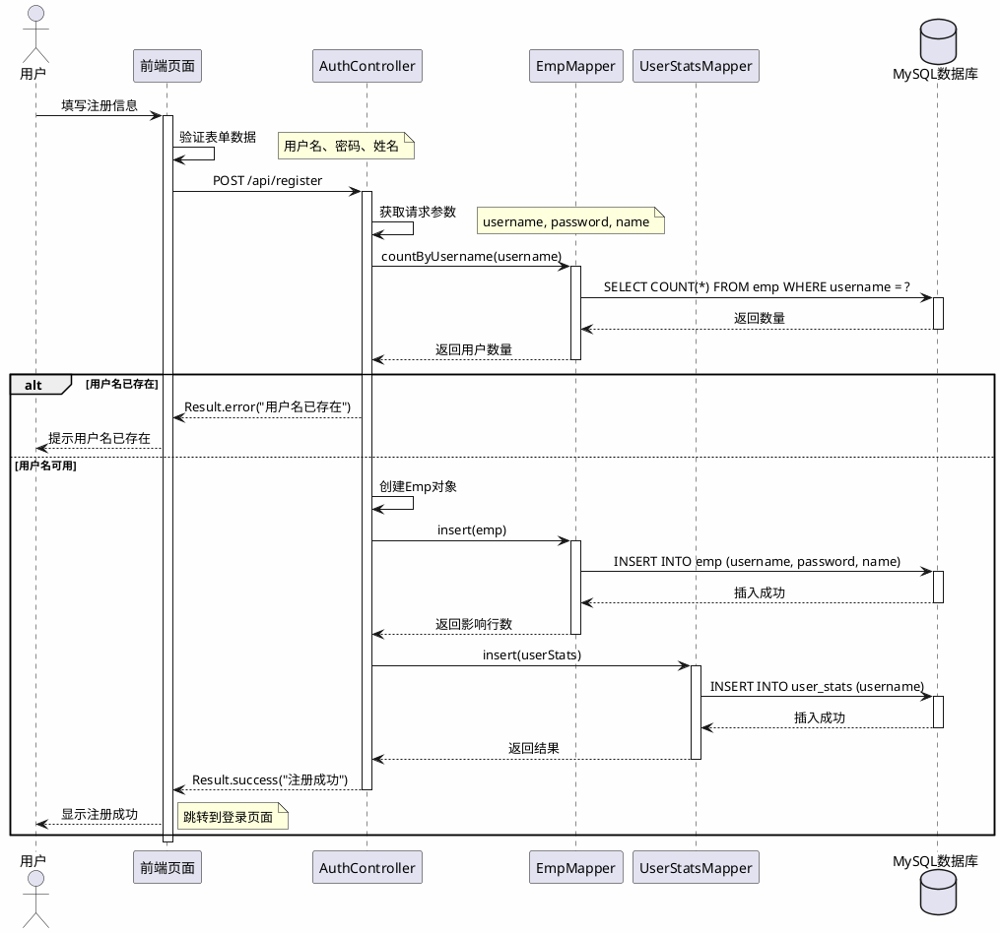

# 用户注册时序图

## 时序图

---

## 注册流程说明

| 步骤 | 操作 | 说明 |
|------|------|------|
| 1 | 填写注册信息 | 用户在前端页面输入用户名、密码、姓名 |
| 2 | 表单验证 | 前端验证用户名长度、密码长度等 |
| 3 | 发送请求 | 前端POST请求到 `/api/register` |
| 4 | 检查用户名 | 查询数据库判断用户名是否已存在 |
| 5 | 创建用户 | 用户名可用则创建Emp对象并插入数据库 |
| 6 | 初始化统计 | 创建UserStats记录初始化用户统计数据 |
| 7 | 返回结果 | 返回注册成功或失败信息 |

---

## 验证规则

| 字段 | 规则 |
|------|------|
| 用户名 | 长度3-20位，不能为空，必须唯一 |
| 密码 | 长度至少6位，不能为空 |
| 姓名 | 可选，默认使用用户名 |

---

## 数据库操作

### emp表插入

| 字段 | 值 |
|------|-----|
| username | 用户输入的用户名 |
| password | 用户输入的密码（明文存储） |
| name | 用户输入的姓名或用户名 |
| gender | 默认值1 |

### user_stats表插入

| 字段 | 值 |
|------|-----|
| username | 用户输入的用户名 |
| view_count | 默认值0 |
| favorite_count | 默认值0 |
| prediction_count | 默认值0 |
