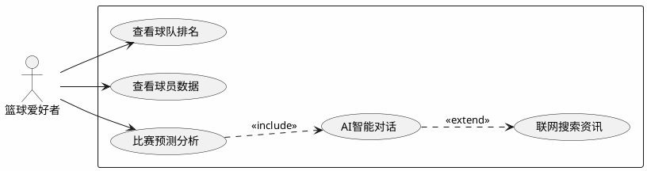
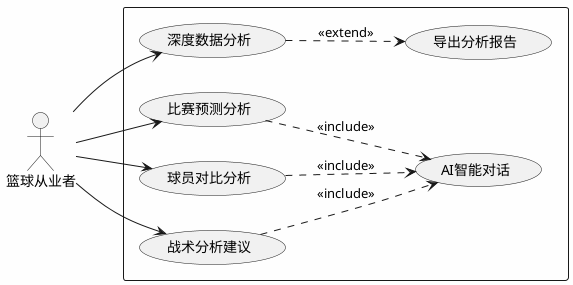
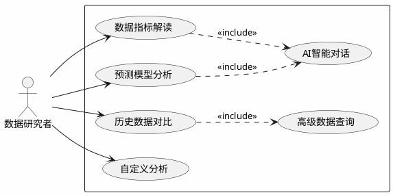
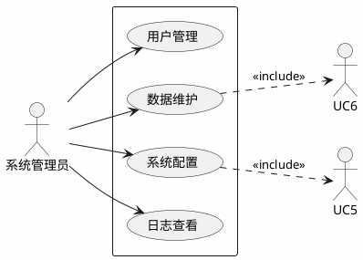

# NBA数据分析系统 - 用户用例图

## 一、篮球爱好者用例图

篮球爱好者是系统的主要用户群体，他们关注NBA赛事、球队和球员信息，希望通过系统获取比赛预测和数据洞察。

### 用例说明

| 用例 | 说明 |
|------|------|
| AI智能对话 | 与AI助手进行自然语言交互，获取NBA相关问题解答 |
| 查看球队排名 | 浏览NBA球队战绩排名和基础数据 |
| 查看球员数据 | 查询球员个人统计数据和表现 |
| 比赛预测分析 | 获取AI生成的比赛胜负预测和分析报告 |
| 联网搜索资讯 | 通过联网搜索获取最新NBA新闻和动态 |

---

## 二、篮球从业者用例图

篮球从业者包括教练、球探、体育记者等，他们需要更专业的数据分析工具来辅助工作决策。

### 用例说明

| 用例 | 说明 |
|------|------|
| AI智能对话 | 与AI进行专业级别的篮球问题讨论 |
| 深度数据分析 | 获取球队/球员的高级数据指标分析 |
| 比赛预测分析 | 获取详细的比赛预测和胜负概率分析 |
| 球员对比分析 | 对比多个球员的数据表现和特点 |
| 战术分析建议 | 获取基于数据的战术建议和分析 |
| 导出分析报告 | 将分析结果导出为报告文件 |

---

## 三、数据研究者用例图

数据研究者包括数据分析师、学术研究人员等，他们关注数据的深度挖掘和高级统计分析。

### 用例说明

| 用例 | 说明 |
|------|------|
| 高级数据查询 | 查询PER、WS、BPM、VORP等高级数据指标 |
| AI智能对话 | 与AI讨论数据分析方法和模型 |
| 数据指标解读 | 获取高级数据指标的含义和计算方式解读 |
| 预测模型分析 | 了解AI预测模型的原理和分析逻辑 |
| 历史数据对比 | 对比不同时期、不同球员的历史数据 |
| 自定义分析 | 通过AI进行自定义的数据分析需求 |

---

## 四、系统管理员用例图

系统管理员负责系统的日常运维、数据维护和用户管理工作。

### 用例说明

| 用例 | 说明 |
|------|------|
| 用户管理 | 管理系统用户账号、权限和角色 |
| 数据维护 | 维护球队、球员等基础数据的完整性 |
| 系统配置 | 配置系统参数和AI服务设置 |
| 日志查看 | 查看系统运行日志和错误记录 |
| API密钥管理 | 管理智谱AI、SearchAPI等外部服务密钥 |
| 数据更新 | 更新NBA比赛数据和球员统计数据 |

---

## 用户群体对比

| 用户群体 | 核心需求 | 主要功能 | 使用频率 |
|----------|----------|----------|----------|
| 篮球爱好者 | 获取资讯、了解比赛 | AI对话、数据查询、比赛预测 | 高 |
| 篮球从业者 | 专业分析、辅助决策 | 深度分析、球员对比、报告导出 | 中高 |
| 数据研究者 | 数据挖掘、学术研究 | 高级查询、指标解读、模型分析 | 中 |
| 系统管理员 | 系统运维、数据维护 | 用户管理、数据更新、系统配置 | 低 |
