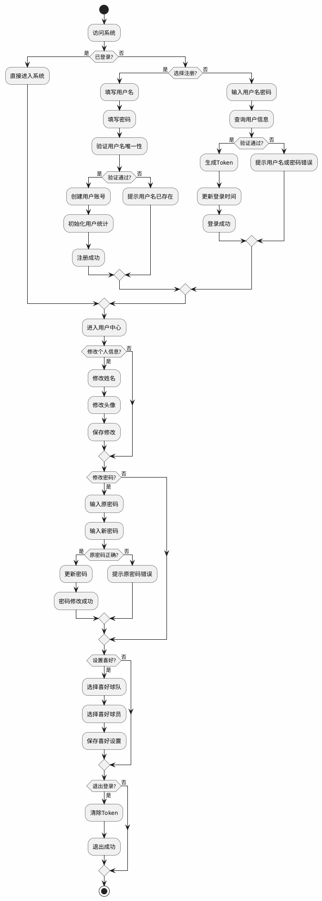
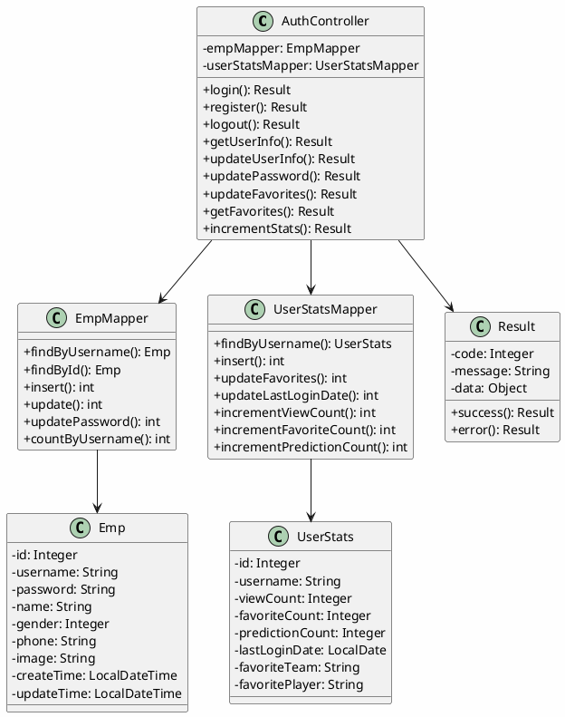
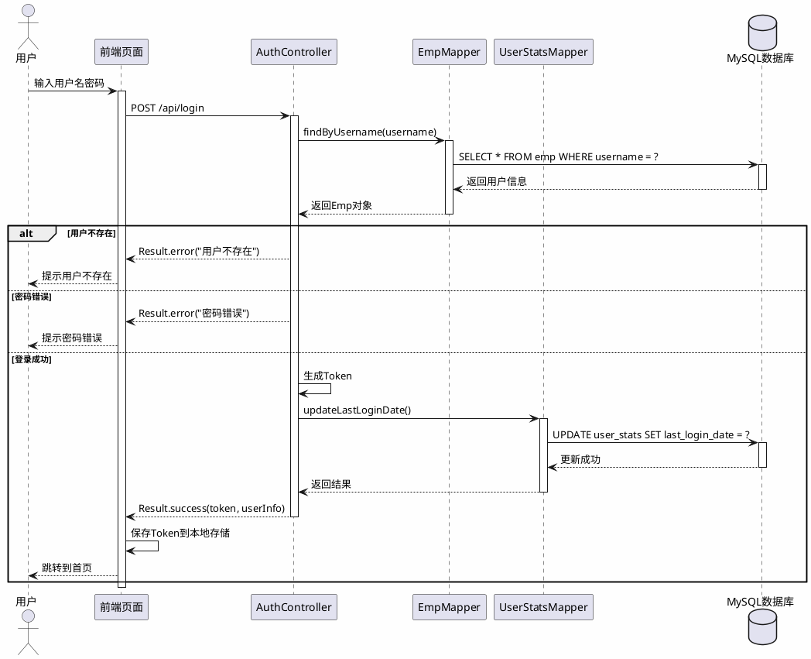
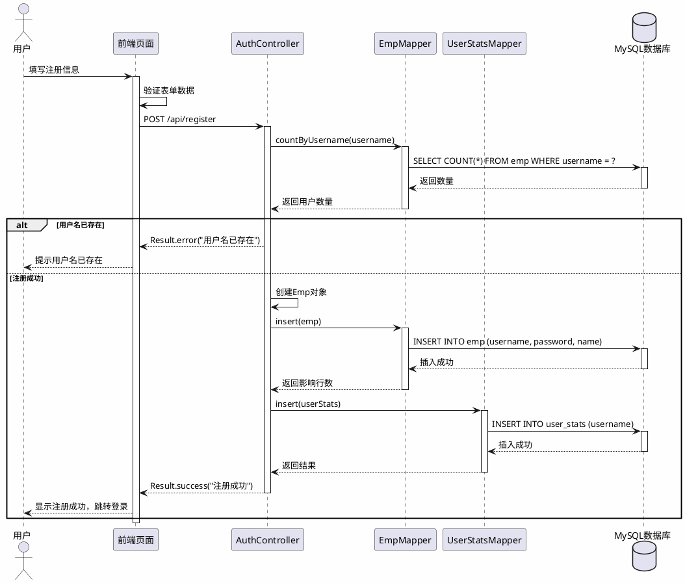
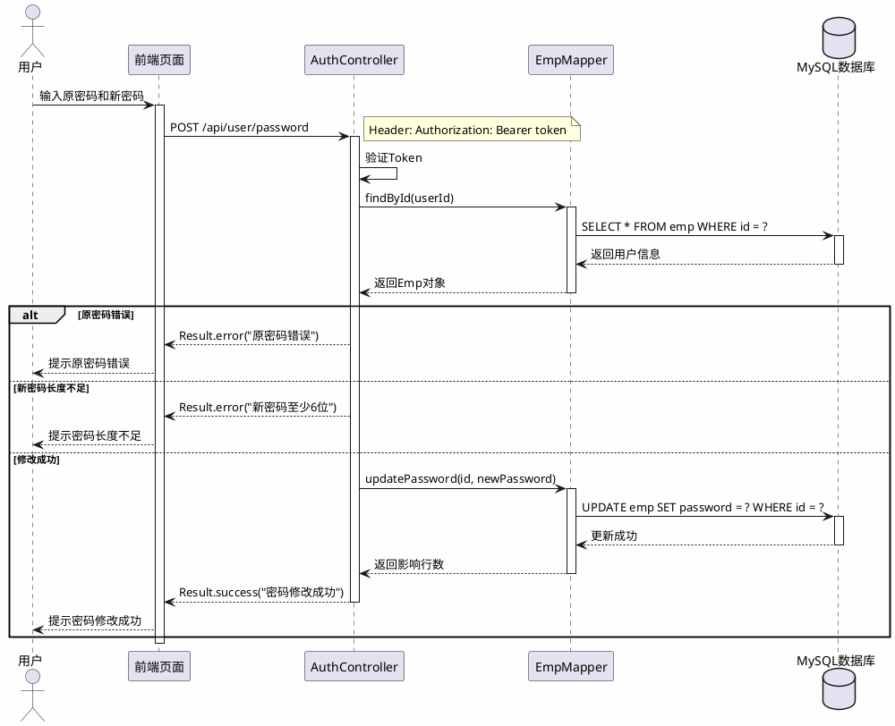

# 用户管理模块 - UML图

## 一、活动图

用户管理模块的活动图展示了用户注册、登录、信息管理等操作的完整流程。

---

## 二、类图

用户管理模块的类图展示了各实体类、控制器和数据访问层之间的关系。

---

## 三、时序图

### 3.1 用户登录时序图

### 3.2 用户注册时序图

### 3.3 修改密码时序图

---

## 四、类职责说明

| 类名 | 类型 | 职责 |
|------|------|------|
| AuthController | 控制器 | 处理用户认证相关请求，包括登录、注册、登出、信息修改等 |
| Emp | 实体类 | 用户基本信息实体，存储用户名、密码、姓名等 |
| UserStats | 实体类 | 用户统计数据实体，记录浏览次数、收藏次数、预测次数等 |
| EmpMapper | 数据访问层 | 用户表数据访问，提供增删改查操作 |
| UserStatsMapper | 数据访问层 | 用户统计表数据访问 |
| Result | 响应类 | 统一API响应格式封装 |

---

## 五、API接口列表

| 接口 | 方法 | 说明 |
|------|------|------|
| /api/login | POST | 用户登录 |
| /api/register | POST | 用户注册 |
| /api/logout | POST | 用户登出 |
| /api/user/info | GET | 获取用户信息 |
| /api/user/update | POST | 更新用户信息 |
| /api/user/password | POST | 修改密码 |
| /api/user/favorites | GET/POST | 获取/设置用户喜好 |
| /api/user/stats/increment | POST | 增加用户统计数据 |
