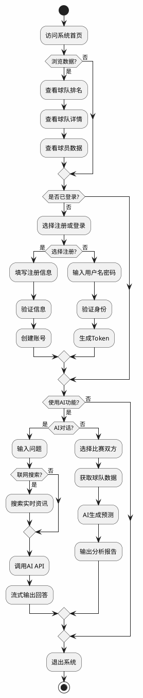
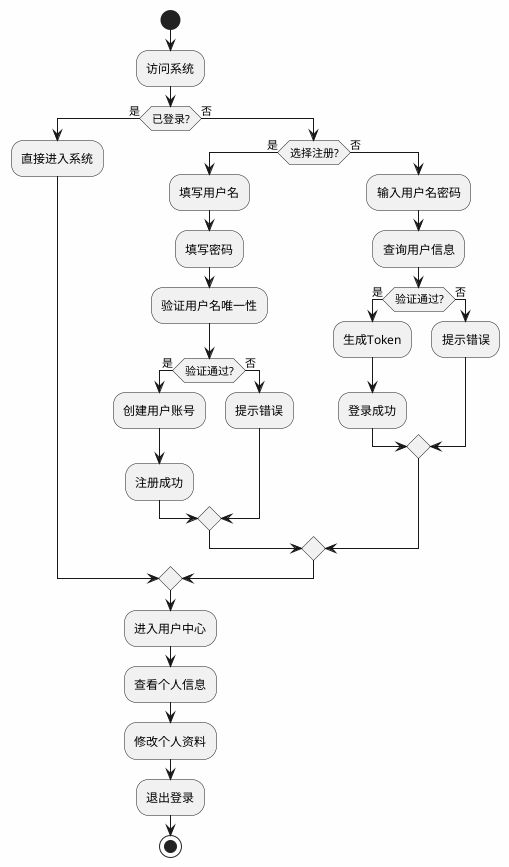
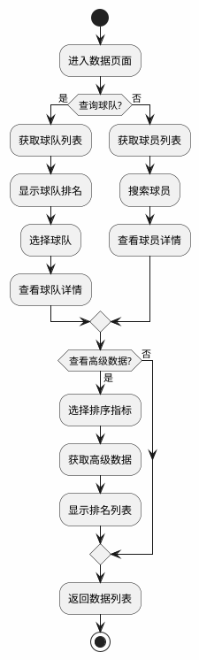
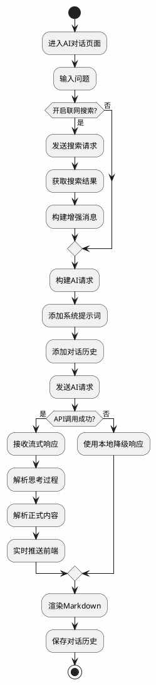
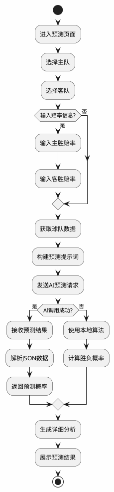
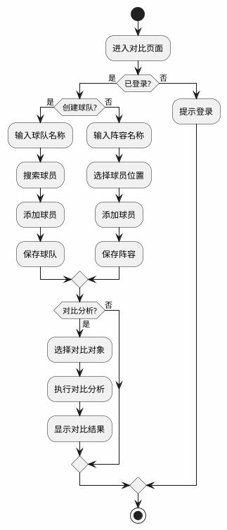

# NBA数据分析系统 - 系统活动图

## 系统整体活动图

---

## 用户管理活动图

---

## 数据查询活动图

---

## AI分析活动图

---

## 比赛预测活动图

---

## 数据对比活动图

---

## 功能模块关系说明

| 模块 | 入口 | 主要步骤数 | 依赖模块 |
|------|------|-----------|----------|
| 用户管理 | 登录/注册入口 | 5-8步 | 无 |
| 数据查询 | 数据页面 | 4-6步 | 无 |
| 数据可视化 | 高级数据页面 | 3-5步 | 数据查询 |
| 数据对比 | 对比页面 | 5-7步 | 用户管理、数据查询 |
| AI分析 | AI对话页面 | 6-10步 | 联网搜索 |
| 比赛预测 | 预测页面 | 7-12步 | 数据查询、AI分析 |

---

## 用户操作路径

| 用户类型 | 典型操作路径 |
|----------|--------------|
| 游客用户 | 浏览数据 → 查看排名 → 查看详情 |
| 注册用户 | 登录 → 浏览数据 → AI对话 → 比赛预测 → 创建阵容 |
| 从业者 | 登录 → 高级数据分析 → 球员对比 → 比赛预测 |
| 管理员 | 登录 → 用户管理 → 数据维护 → 系统配置 |
