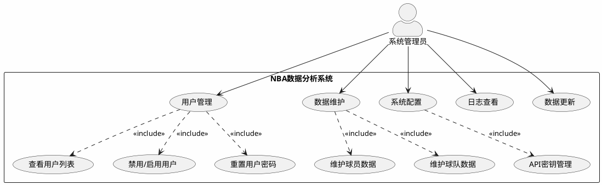
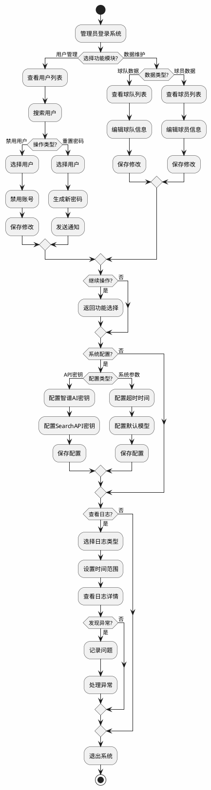
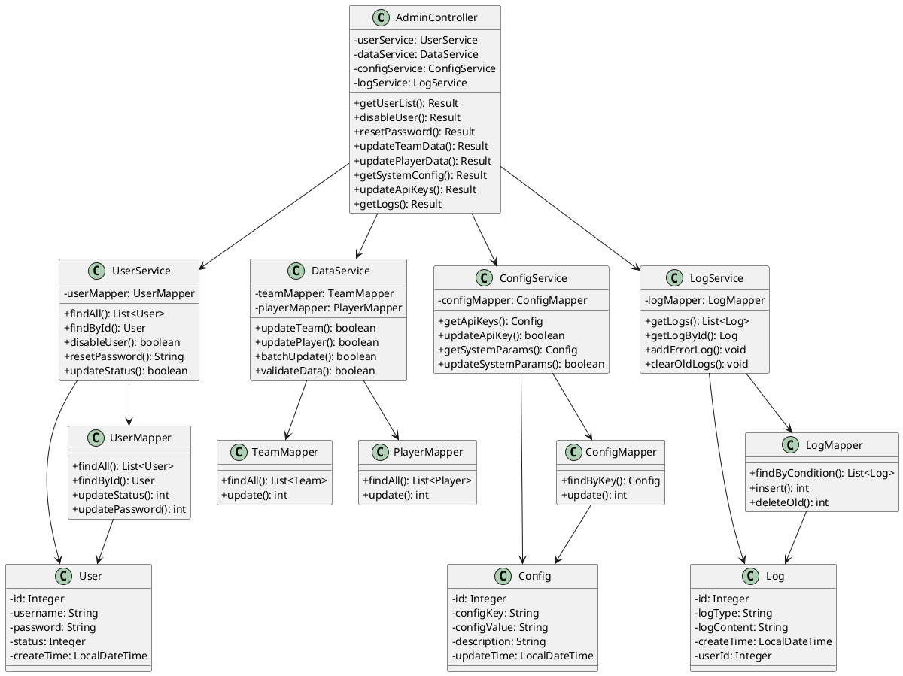
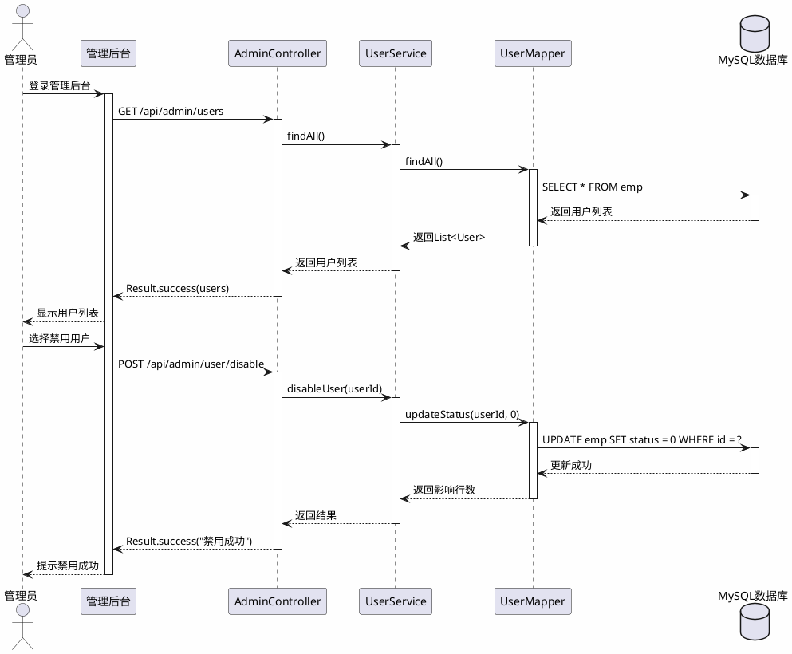
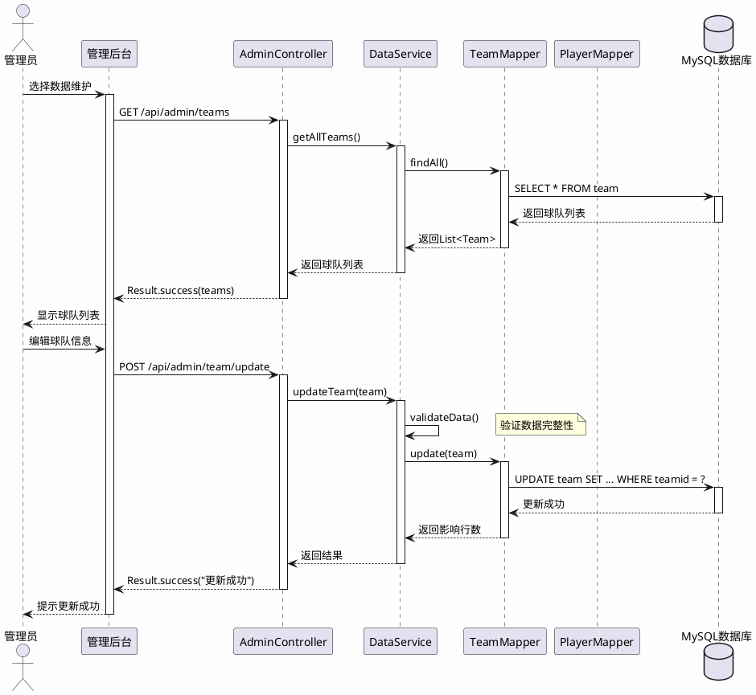
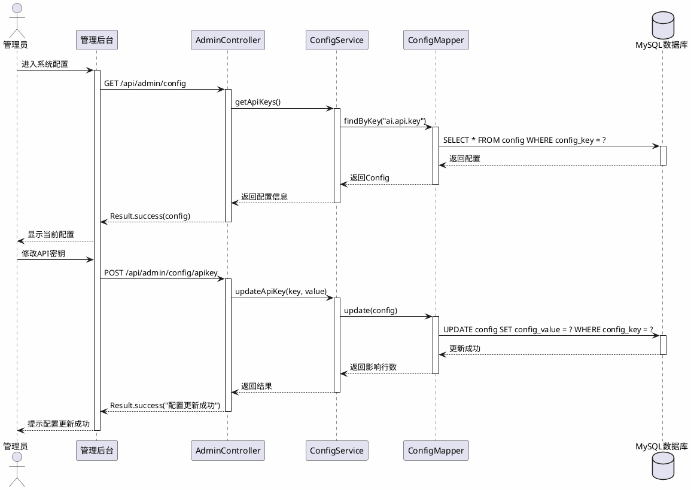
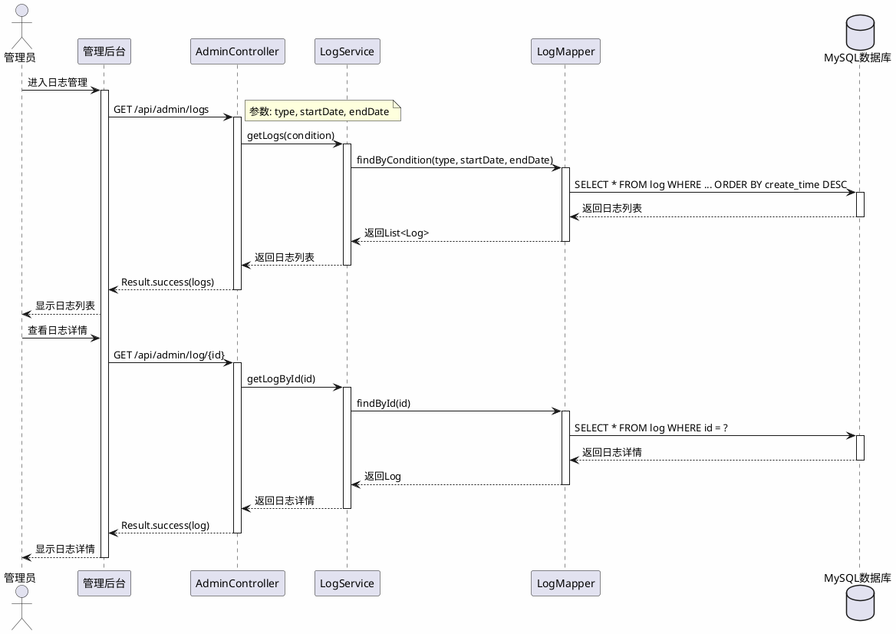

# 系统管理员模块 - UML图

## 一、用例图

系统管理员负责系统的日常运维、数据维护和用户管理工作。

### 用例说明

| 用例 | 说明 |
|------|------|
| 用户管理 | 管理系统用户账号，包括查看、禁用、重置密码等 |
| 数据维护 | 维护球队、球员等基础数据的完整性 |
| 系统配置 | 配置系统参数和外部服务密钥 |
| 日志查看 | 查看系统运行日志和错误记录 |
| 数据更新 | 更新NBA比赛数据和球员统计数据 |
| API密钥管理 | 管理智谱AI、SearchAPI等外部服务密钥 |

---

## 二、活动图

---

## 三、类图

### 类职责说明

| 类名 | 类型 | 职责 |
|------|------|------|
| AdminController | 控制器 | 处理管理员相关请求，提供管理API接口 |
| UserService | 服务层 | 用户管理业务逻辑 |
| DataService | 服务层 | 数据维护业务逻辑 |
| ConfigService | 服务层 | 系统配置业务逻辑 |
| LogService | 服务层 | 日志管理业务逻辑 |
| User | 实体类 | 用户信息实体 |
| Config | 实体类 | 系统配置实体 |
| Log | 实体类 | 系统日志实体 |

---

## 四、时序图

### 4.1 用户管理时序图

### 4.2 数据维护时序图

### 4.3 系统配置时序图

### 4.4 日志查看时序图

---

## 五、管理员功能列表

| 功能模块 | 功能项 | 操作 |
|----------|--------|------|
| 用户管理 | 用户列表 | 查看、搜索、筛选 |
| 用户管理 | 账号状态 | 禁用、启用 |
| 用户管理 | 密码管理 | 重置密码 |
| 数据维护 | 球队数据 | 查看、编辑、更新 |
| 数据维护 | 球员数据 | 查看、编辑、更新 |
| 系统配置 | API密钥 | 配置智谱AI、SearchAPI密钥 |
| 系统配置 | 系统参数 | 配置超时时间、默认模型 |
| 日志管理 | 日志查看 | 按类型、时间查看日志 |
| 日志管理 | 日志清理 | 清理过期日志 |

---

## 六、管理员API接口

| 接口 | 方法 | 说明 |
|------|------|------|
| /api/admin/users | GET | 获取用户列表 |
| /api/admin/user/disable | POST | 禁用用户 |
| /api/admin/user/enable | POST | 启用用户 |
| /api/admin/user/reset-password | POST | 重置用户密码 |
| /api/admin/teams | GET | 获取球队列表 |
| /api/admin/team/update | POST | 更新球队数据 |
| /api/admin/players | GET | 获取球员列表 |
| /api/admin/player/update | POST | 更新球员数据 |
| /api/admin/config | GET | 获取系统配置 |
| /api/admin/config/apikey | POST | 更新API密钥 |
| /api/admin/logs | GET | 获取日志列表 |
| /api/admin/log/{id} | GET | 获取日志详情 |
